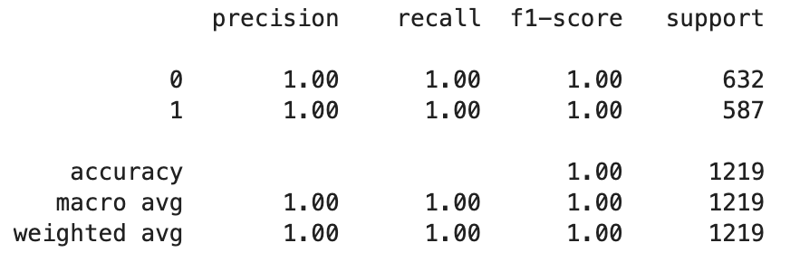

# Classifying Mushrooms as Poisonous or Not (tabular data)
## Running the Code
All relevant code is in the Mushroom Edibility jupyter notebook.

## Problem Description & Goal
My goal was to correctly classify mushrooms as poisonous or edible. My test statistic is % of mushrooms correctly classified. If we were using this in real life, we would care a *lot* about error type (e.g. it's much worse to call a poisonous mushroom edible than the other way around), but this was good enough for our use case. 

We have ~8k samples of tabular data about mushrooms. Each mushroom is tagged as 'p' or 'e' for poisonous or edible, and has many other categorizations (e.g. cap shape, cap color, gill size, ring type, etc.). 

All the data is categorical.

## Model Choice 
I chose to use a random forest model because it handles categorical data well, it's quick to train, you don't have to pre-specifying of interaction effects, and it can handle many more interactions without overfitting. In the case of mushrooms, I expect there to important interactions—e.g. this color + this shape is poisonous, but this color + different shape is not—but I don't know what those interactions are ahead of time.

If we had a lot more data, we could consider a neural network for potential performance improvements. If we had a clearer model of what interactions are relevant (e.g. from a micologist) and cared more about interpretability, we may prefer to use a logistic regression.

## Data Cleaning & Exploration 
I split my data into train, validation, and test data and only explored the training data. 

I looked at standard summary stats, checked for missing data (there was none), and for each variable counted how many datapoints were poisonous vs not (e.g. gill color n has ~75 poisonous samples and over 600 non-poisonous ones). This helped me get a basic sense of what model may be a good fit and what kind of data we were working with. 

From this examination alone, you can see that odor is a near perfect predictor of poison vs edible (each variable has almost all samples as one or the other). You can also see that many other variables are likely to have predictive power. We could also manually look through some interactions, but I decided to leave that to the random forest. 

## Outcomes and Learnings 
- Model performance was perfect out the gate: 

    

This made me double check my code for data leakage (as 100% is usually a real tipoff of something wrong), but it turns out that it's much easier to classify (these) mushrooms than expected! (As the near perfect predictive power of odor in the data exploration would suggest.)

Odor = "n" or "f" are two of the most important features, but gill size, stalk surface, and ring size mattered among other things. 

That made me curious about how much work odor could do alone. It turns out it's nearly perfectly predictive! We get .98 precision and 1 recall with just odor as a predictor. (Not good enough to eat, but still good for a model!)

Then I got curious if the model could do well without odor, and it turns out that even if you drop odor the model can still achieve 100% accuracy. In fact, I had to remove the 10 most predictive features to get below 100% performance. This is interesting because it means there are many different ways to determine if a mushroom is poisonous. 

In fact, even if you limit yourself to the 6 least predictive features, you can get to 92% recall and 93% precision. In other words, there's a lot of signal even in the least valuable data.

Findings like that could be important if 1) we were using something like this in a situation where high accuracy was important and 2) we had a lot of missing data and needed to decide where we were confident enough to make a prediction vs not. 

